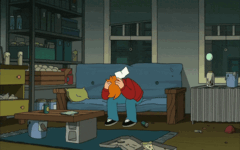

<h1 align="center">Light and Dark Wallpapers for Gnome 42</h1>


#### :art: Preview

| 			   	              										        			| 			     															     | 															   	  			     | 																	         |
|
|
| :---------------------------------------------------------------------------------------------------------: | :------------------------------------------------------------------------------------------------------:  | :---------------------------------------------------------------------------------------------------------: | :------------------------------------------------------------------------------------------------: |
| :------------------------------------------------------------------------------------------------: |
| AnimeRoom | Aura | Carvan | CatherineRoom | Coast | 
|  |  |  |  |  |
| CorporationHall | CorporationStreet | DesertPeak | DesertSands | DesertTree |
|  |  |  |  |  |
| DesertValley | Dome | DynamicFry | ExternalHimitsuHouse | Firewatch |
|  |  |  |  |  |
| Firewatch2 | FocalFossa | Fuji | Globe | GroovyGorilla |
|  |  |  |  |  |
| HimitsuHouse | HirsuitHippo | HirsuitHippoBlue | KagomeRoom | Lakeside | 
|  |  |  |  |  |
| LakesideDeer | LakeTheCliff | LofiALex | LofiDino | LofiGirl |
|  |  |  |  |  |
| MaterialMountains | MinimalMojave | Mojave | Monterey | PlasticBeach | 
|  |  |  |  |  |
| Riverside | Rock | Rocknegy | Rockscketto | StevenUniverse |
|  |  |  |  |  |
| TheBeach | TheDesert | TheLake | TokyoStreet | Viragegy |
|  |  |  |  |  |
| Viragharom | Viragnegy | Win11Lake | Windows111 | Windows112 |
|  |  |  |  |  |
| Windows113 | Wiravketto |
|  |  |

#### :gear: Installation:

1. Open Terminal: **ctrl + alt + T**
2. Run the following command:
	```
	curl -s "https://raw.githubusercontent.com/amrosolaiman/Light-and-Dark-Wallpapers-for-Gnome-42/main/direct_install.sh" | bash
	```
3. Change your wallpaper from: **Settings > Appearence**
4. That's it. Enjoy! :tada:
#### :rocket: Recommended Gnome Extensions
- [Night Theme Switcher](https://nightthemeswitcher.romainvigier.fr/)
- [Blur my Shell](https://github.com/aunetx/blur-my-shell)

#### :paintbrush: Wallpapers Authors:
- Apple Inc.
- Ubuntu
- Gnome
- lofigirl.com
- Arseniy Chebynkin
- Evgeniy Slushev
- Louis Coyle
- Microsoft
- Updating...

#### :memo: Notes
- This work is inspired and intensely based on [saint-13 project](https://github.com/saint-13/Linux_Dynamic_Wallpapers)
- This work is supported only on Gnome 42

<!-- 🎨 Preview

| 			   	              										        			| 			     															     | 															   	  			     | 																	         |
| :---------------------------------------------------------------------------------------------------------: | :------------------------------------------------------------------------------------------------------:  | :---------------------------------------------------------------------------------------------------------: | :------------------------------------------------------------------------------------------------: |
| Dynamic Fry 	   	              															        | Riverside 		     																     | 												 					     	             | 															     			 |
|  	   	              															        |  		     																     | 												 					     	             | 															     			 |
-->
<!--
| 			   	              										        			| 			     															     | 															   	  			     | 																	         |
| :---------------------------------------------------------------------------------------------------------: | :------------------------------------------------------------------------------------------------------:  | :---------------------------------------------------------------------------------------------------------: | :------------------------------------------------------------------------------------------------: |
| 	   	              															        | 		     																     | 												 					     	             | 															     			 |
| 	   	              															        | 		     																     | 												 					     	             | 															     			 |
-->

<!--
#### Method 2: for *experts* but saves time and data :nerd_face:

1. Download package:

    - If you already cloned repository, just pull to fetch recent changes:

        ```
        cd ~/Light&DarkWallpapers4Gnome42
        git pull
        ```

    - If not, clone git repository:

      ```
      cd ~
      git clone https://github.com/amro_solaiman/Light&DarkWallpapers4Gnome42.git
      cd Light&DarkWallpapers4Gnome42
      ```

2. Run the command:

    	sudo bash ./install.sh

3. Change your wallpaper from: Settings > Backgrounds

4. That's it. Enjoy! :tada:

## :paintbrush: Wallpapers Authors:
- Arseniy Chebynkin
- Updating...

## :octocat: I want to contribute!

That's great!
Here are some basic rules to get you started:
Commits should start with a Capital letter and should be written in present tense (e.g. __:tada: Add cool new feature__ instead of __:tada: Added cool new feature__).
You should also start your commit message with **one** applicable emoji.
This does not only look great but also makes you rethink what to add to a commit. Make many but small commits!

Emoji | Description
------|------------
:tada: `:tada:` | When you added a cool new feature.
:wrench: `:wrench:` | When you added a piece of code.
:recycle: `:recycle:` | When you refactored a part of the code.
:sparkles: `:sparkles:` | When you applied clang-format.
:globe_with_meridians: `:globe_with_meridians:` | When you worked on translations.
:art: `:art:` | When you improved / added assets like themes.
:lipstick: `:lipstick:` | When you worked on the UI of the preferences dialog.
:rocket: `:rocket:` | When you improved performance.
:memo: `:memo:` | When you wrote documentation.
:beetle: `:beetle:` | When you fixed a bug.
:revolving_hearts: `:revolving_hearts:` | When a new sponsor is added or credits are updated.
:heavy_check_mark: `:heavy_check_mark:` | When you worked on checks or adjusted the code to be compliant with them.
:twisted_rightwards_arrows: `:twisted_rightwards_arrows:` | When you merged a branch.
:fire: `:fire:` | When you removed something.
:truck: `:truck:` | When you moved / renamed something.


## :revolving_hearts: Countributors
Thanks goes to these wonderful people:
- [amro_solaiman](https://github.com/amrosolaiman)
- [saint-13](https://github.com/saint-13)

## :radioactive: Notice:
- If you don't want your device to be the source of humanity extinction, please do not use the 2static1dynamic.sh script without reading what does it contain. Please.

-->


<!--| 			   	              										        			| 			     															     | 															   	  			     | 																	         |
| :---------------------------------------------------------------------------------------------------------: | :------------------------------------------------------------------------------------------------------:  | :---------------------------------------------------------------------------------------------------------: | :------------------------------------------------------------------------------------------------: |
|[saint-13](https://github.com/saint-13)										       	| [amro_solaiman](https://github.com/amrosolaiman)						     | [ComradeCat24](https://github.com/ComradeCat24)		 	  			     | [Mohammedziad599](https://github.com/Mohammedziad599)		         |
|  | 			     															     |  |  |																	         |
-->
